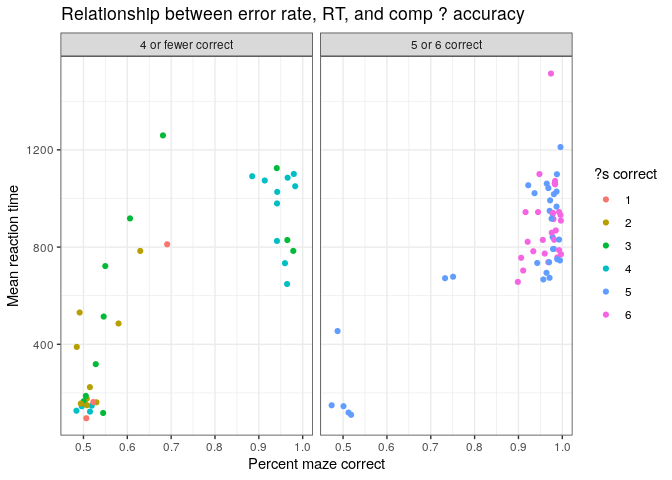
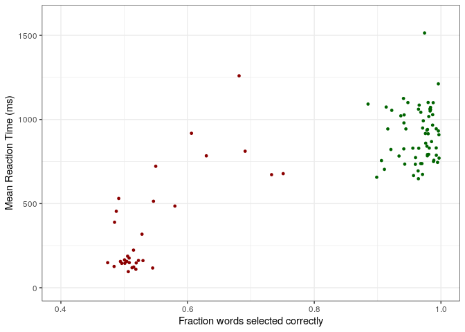

Natural Stories
================

# Experiment

Motivation: The point of this experiment was to determine if Maze works
on naturalistic text. Do participants comprehend what they are reading
while doing this task? Do frequency, length and surprisal effects show
up in the reading times?

To this end, we tested participants on stories from the Natural Stories
corpus. The corpus consists of 10 stories (some fiction, some
non-fiction) each about 1000 words, and has 6 comprehension questions
for each. It has previously been run as SPR, where freq/surprisal/length
show up and we have the comprehension question accuracies, so we have
something to compare to.

1000 words is a lot for Maze especially when it needs to be done in one
chunk (whereas we’d put pause screens in previous maze experiments, I
didn’t here because it could disrupt the story), so we had each
participant only read one story. This was prefaced by a short practice
item (~100 words) that I wrote, which had 2 practice questions.

At the end, we collected some optional demographics and debriefed
participants.

We recruited 100 participants, across the 10 stories. (Stories were
randomized, but not balanced, so we’ll see how balanced the data is.) We
estimated that this would take around 20 minutes (given how long past
studies had taken) and paid 3.50.

# Assorted preliminaries

We got data from 100 subjects, after exluding those with a reported
native language other than English, 95 remain.

Within the filtered data, each story was read between 7 and 12 times.
This seems like decent distribution.

## Error rates

There’s lots of ways to try to get at participant diligence that we
might want to use for exclusions. In particular, it appears that mean
accuracy is correlated with mean rt – people with high accuracy take
longer than people who look like they are randomly guessing. In this
experiment, we have an additional source of insight into diligence –
comprehension question accuracy. In the SPR natural stories experiment,
they used 5 out of 6 comprehension questions correct as their threshold
for data inclusion.

The below plot shows how accurate participants were on the task
(measured per word), versus mean reaction time (note that a filter of
rt\<5000 was used to exclude times when a participant got distracted or
paused in doing the experiment). Coloring indicates how many of the
comprehension questions (out of 6) they got right, and the grids are
faceted on the SPR exclusion criteria for comparison. (Practice items
and practice questions are not included
    here.)

    ## `summarise()` regrouping output by 'subject' (override with `.groups` argument)

<!-- -->

It appears that it is indeed possible to comprehend these stories while
doing the maze task. There’s clearly a correlation between accuracy on
comprehension questions and accuracy on maze, although there is some
variability. When the task is done well, average RT is between 600 and
1200 – average RTs below 500 are unlikely to be attentive.

Unclear what the correct thresholds for exclusions should be, although
I’m tempted by an 80% accuracy cut-off (for RT stuff at least). If
measures of interest are about comprehension, comprehension questions
seem
reasonable.

## Graphs for abstract

<!-- --><!-- --><!-- -->

## Are comprehension questions working

As was raised when I presented this at lab meeting, it could be that
participants are looking up answers to comprehension questions, so we
want to check based on
    length.

<!-- -->

    ## `summarise()` regrouping output by 'subject' (override with `.groups` argument)

    ## `stat_bin()` using `bins = 30`. Pick better value with `binwidth`.

<!-- -->

Can play around with cutoffs etc, but the net result is that most of the
answering is happening within 10 (much within 5) seconds, and it doesn’t
look like people are looking up answers, so comprehension is probably
reliable.

## Experiment length, pay

The other point of interest is how long the experiment takes overall;
we’re curious about this for designing appropriate length experiments
and compensating adequately in the future. This takes into account all
the time spent doing maze, including practice items and correcting
mistakes. It does not include time to read instructions, answer
comprehension questions or fill out
    demographics.

    ## `summarise()` regrouping output by 'subject' (override with `.groups` argument)

<!-- -->

It seems like 20 minutes isn’t a horribly off estimate, but that 25
minutes is more reasonable if we want an upper bound accounting for some
time to do demographics.

In the random questions at the end section, particpants were asked how
much they thought this should pay, common answers where 3.50, 4, and 5.
(Experiment paid 3.50, maybe we should consider upping it a little,
depending on what the timing data is.)

<table>

<thead>

<tr>

<th style="text-align:right;">

pay.numeric

</th>

<th style="text-align:right;">

n

</th>

</tr>

</thead>

<tbody>

<tr>

<td style="text-align:right;">

2.50

</td>

<td style="text-align:right;">

1

</td>

</tr>

<tr>

<td style="text-align:right;">

3.00

</td>

<td style="text-align:right;">

5

</td>

</tr>

<tr>

<td style="text-align:right;">

3.50

</td>

<td style="text-align:right;">

25

</td>

</tr>

<tr>

<td style="text-align:right;">

3.75

</td>

<td style="text-align:right;">

1

</td>

</tr>

<tr>

<td style="text-align:right;">

4.00

</td>

<td style="text-align:right;">

21

</td>

</tr>

<tr>

<td style="text-align:right;">

4.50

</td>

<td style="text-align:right;">

1

</td>

</tr>

<tr>

<td style="text-align:right;">

5.00

</td>

<td style="text-align:right;">

23

</td>

</tr>

<tr>

<td style="text-align:right;">

6.00

</td>

<td style="text-align:right;">

3

</td>

</tr>

<tr>

<td style="text-align:right;">

8.00

</td>

<td style="text-align:right;">

1

</td>

</tr>

<tr>

<td style="text-align:right;">

10.00

</td>

<td style="text-align:right;">

2

</td>

</tr>

<tr>

<td style="text-align:right;">

80.00

</td>

<td style="text-align:right;">

1

</td>

</tr>

<tr>

<td style="text-align:right;">

NA

</td>

<td style="text-align:right;">

11

</td>

</tr>

</tbody>

</table>

Taking these two pieces together, paying 4 or 5 dollars is probably
better.

## Participants experience

What participants thought: participants were both asked what they
thought the experiment was about and whether they used any strategies.
(Second question was prompted from hearing that other people running
maze get answers like “look at one side, only check the other if it
doesn’t seem plausible” and the like.)

<table>

<thead>

<tr>

<th style="text-align:right;">

pct\_correct

</th>

<th style="text-align:left;">

topic

</th>

<th style="text-align:left;">

strategy

</th>

</tr>

</thead>

<tbody>

<tr>

<td style="text-align:right;">

0.9970385

</td>

<td style="text-align:left;">

Not sure. Something like a memory test when reading one word at a time.

</td>

<td style="text-align:left;">

I used the strategy if pressing 1 and 2 with my fingers.

</td>

</tr>

<tr>

<td style="text-align:right;">

0.9968017

</td>

<td style="text-align:left;">

Seeing how people retain information

</td>

<td style="text-align:left;">

I enjoyed this. I just tried to pick words to further the sentence.

</td>

</tr>

<tr>

<td style="text-align:right;">

0.9959596

</td>

<td style="text-align:left;">

To see if people are good at predicting the next word in a sentence.

</td>

<td style="text-align:left;">

I tried to pick the word that was the best fit. It was pretty obvious
most of the time, and I guessed for anything that I wasn’t sure about.

</td>

</tr>

<tr>

<td style="text-align:right;">

0.9958974

</td>

<td style="text-align:left;">

I think the study involves learning about respondents’ knowledge of
syntax.

</td>

<td style="text-align:left;">

It was interesting. I tried to remember the previous part of each
sentence as I continued with the task, and then I chose the word that
would make the most sense to be placed next in the sentence.

</td>

</tr>

<tr>

<td style="text-align:right;">

0.9946695

</td>

<td style="text-align:left;">

I think it’s measuring our reading pace vs. comprehension.

</td>

<td style="text-align:left;">

It was painful and got pretty tedious. I was so focused but started to
mess up more and more towards the end. I didn’t use any strategies
besides reading it in my head.

</td>

</tr>

<tr>

<td style="text-align:right;">

0.9927207

</td>

<td style="text-align:left;">

I’m not sure\! I enjoyed that. I made a couple/few dumb mistakes.

</td>

<td style="text-align:left;">

It went well. I read a to and just tried to follow what sounded like a
natural flow. I made a few dumb errors. Once the choices were both
“Sticky,” and I saw no difference but I chose the “wrong” one. When
the I followed the word you, I messed up. Enjoyed it overall.

</td>

</tr>

<tr>

<td style="text-align:right;">

0.9926063

</td>

<td style="text-align:left;">

How well you can recall story events when presented the information one
word at a time

</td>

<td style="text-align:left;">

I simply tried to go at a faster pace so I could keep the story flowing
smoothly

</td>

</tr>

<tr>

<td style="text-align:right;">

0.9925443

</td>

<td style="text-align:left;">

Not sure, but seems to be about story telling.

</td>

<td style="text-align:left;">

I just tried my best to complete the story.

</td>

</tr>

<tr>

<td style="text-align:right;">

0.9888060

</td>

<td style="text-align:left;">

If choosing the next word makes the story easier to remember? I should
also add that the mistakes I made weren’t from choosing the wrong word,
but from my fingers working faster than my brain and accidentally
pressing a button before properly deciding which word to pick.

</td>

<td style="text-align:left;">

I ready the story out loud as I went and found it pretty easy to
determine what word should come next.

</td>

</tr>

<tr>

<td style="text-align:right;">

0.9882854

</td>

<td style="text-align:left;">

I’m not sure. How we process sentences?

</td>

<td style="text-align:left;">

Fine. I just assumed the next word before i saw it usually.

</td>

</tr>

<tr>

<td style="text-align:right;">

0.9877551

</td>

<td style="text-align:left;">

I have no idea

</td>

<td style="text-align:left;">

No strategies. I actually enjoyed it

</td>

</tr>

<tr>

<td style="text-align:right;">

0.9869739

</td>

<td style="text-align:left;">

Slow reading comprehension

</td>

<td style="text-align:left;">

Sometimes, my brain would choose a word but my hand would choose
incorrectly, but most of the tima it was fluid

</td>

</tr>

<tr>

<td style="text-align:right;">

0.9868554

</td>

<td style="text-align:left;">

Reading comprehension

</td>

<td style="text-align:left;">

I tried to guess the next world based on the context of the previous
word. It was generally easier to figure out which word didn’t make sense
than to guess which one did. So it was just a matter of selecting the
other word.

</td>

</tr>

<tr>

<td style="text-align:right;">

0.9851632

</td>

<td style="text-align:left;">

I think this study is about how long you can maintain focus and
concentration on a text, and then how much of it you can recall.

</td>

<td style="text-align:left;">

I think I made some mistakes, I didn’t use any particular strategy, I
just tried to stay focused as much as I could and to follow the sense of
the text.

</td>

</tr>

<tr>

<td style="text-align:right;">

0.9835907

</td>

<td style="text-align:left;">

not sure

</td>

<td style="text-align:left;">

just tried to read it normally.

</td>

</tr>

<tr>

<td style="text-align:right;">

0.9835431

</td>

<td style="text-align:left;">

See how well people can retain knowledge when read a text one word at a
time, and seeing other words that are not related.

</td>

<td style="text-align:left;">

It was interesting. Most of the time it was pretty easy to guess what
the next word was from the two.

</td>

</tr>

<tr>

<td style="text-align:right;">

0.9829060

</td>

<td style="text-align:left;">

To see if people can understand what they read when it it given to them
in a manner such as this.

</td>

<td style="text-align:left;">

I was trying to guess what word would be next, but that did hurt me a
few times as I miss clicked a few times because of it.

</td>

</tr>

<tr>

<td style="text-align:right;">

0.9826087

</td>

<td style="text-align:left;">

Memory

</td>

<td style="text-align:left;">

Reading aloud.

</td>

</tr>

<tr>

<td style="text-align:right;">

0.9815498

</td>

<td style="text-align:left;">

not sure, perhaps reading comprehension

</td>

<td style="text-align:left;">

no strategies, just tried not to inadvertently hit the wrong key. i
enjoyed the task

</td>

</tr>

<tr>

<td style="text-align:right;">

0.9808102

</td>

<td style="text-align:left;">

It was pretty interesting. I got frustrated when I made simple errors
such as accidentally double clicking, because I actually became
invested. I am curious to know if information is easier to be retained
when learned in this fashion, and if that was the purpose of the study.

</td>

<td style="text-align:left;">

My strategy was to simple make sense of what I was reading.

</td>

</tr>

<tr>

<td style="text-align:right;">

0.9806452

</td>

<td style="text-align:left;">

I don’t know.

</td>

<td style="text-align:left;">

I just read.

</td>

</tr>

<tr>

<td style="text-align:right;">

0.9798077

</td>

<td style="text-align:left;">

How people can guess words of a story

</td>

<td style="text-align:left;">

I just used the flow of the words

</td>

</tr>

<tr>

<td style="text-align:right;">

0.9797776

</td>

<td style="text-align:left;">

NA

</td>

<td style="text-align:left;">

NA

</td>

</tr>

<tr>

<td style="text-align:right;">

0.9788258

</td>

<td style="text-align:left;">

I’m not fully certain but I think it has to do with how people
understand and comprehend stories.

</td>

<td style="text-align:left;">

I simply relied upon my memory and reading ability.

</td>

</tr>

<tr>

<td style="text-align:right;">

0.9787823

</td>

<td style="text-align:left;">

Testing how well people retain information while reading.

</td>

<td style="text-align:left;">

I just focused on the task and tried to visualize the story.

</td>

</tr>

<tr>

<td style="text-align:right;">

0.9785648

</td>

<td style="text-align:left;">

How various people process information in bits rather than all at once.

</td>

<td style="text-align:left;">

My experience felt a bit rushed. However, I did my best to retain the
information. I noted key words that I felt were most important as my
strategy.

</td>

</tr>

<tr>

<td style="text-align:right;">

0.9778802

</td>

<td style="text-align:left;">

Thank you\! Awesome study in memory\!

</td>

<td style="text-align:left;">

Very good. I just told the story to my mind as I went through the
sentences.

</td>

</tr>

<tr>

<td style="text-align:right;">

0.9778598

</td>

<td style="text-align:left;">

I honestly have no idea, something about logical sentence structures?

</td>

<td style="text-align:left;">

nothing that took conscious thought, but sometimes I accidentally
pressed the wrong key

</td>

</tr>

<tr>

<td style="text-align:right;">

0.9759615

</td>

<td style="text-align:left;">

Possibly a cognitive memory task.

</td>

<td style="text-align:left;">

I just tried to keep the story flowing in my mind.

</td>

</tr>

<tr>

<td style="text-align:right;">

0.9755102

</td>

<td style="text-align:left;">

what people can remember from a story and how good people are at
selecting the right words to continue the story

</td>

<td style="text-align:left;">

I enjoyed this task and I just tried to pick the word I thought best fit

</td>

</tr>

<tr>

<td style="text-align:right;">

0.9741459

</td>

<td style="text-align:left;">

Memory and focus test I think.

</td>

<td style="text-align:left;">

Not much of a statergy, BUt I was kinda predicting what was going to
happen in the story.

</td>

</tr>

<tr>

<td style="text-align:right;">

0.9721670

</td>

<td style="text-align:left;">

understanding memory reading

</td>

<td style="text-align:left;">

enjoyed

</td>

</tr>

<tr>

<td style="text-align:right;">

0.9711090

</td>

<td style="text-align:left;">

Attention and memory, perhaps.

</td>

<td style="text-align:left;">

My experience was good. I really used no strategy. I just read and did
my best to remember what I had read.

</td>

</tr>

<tr>

<td style="text-align:right;">

0.9709127

</td>

<td style="text-align:left;">

No idea

</td>

<td style="text-align:left;">

Tried to follow along

</td>

</tr>

<tr>

<td style="text-align:right;">

0.9699700

</td>

<td style="text-align:left;">

Testing if this method of inputting each word helps with memory

</td>

<td style="text-align:left;">

I just went with what word naturally came next. There were only a few
that I didn’t instantly have an instinct on.

</td>

</tr>

<tr>

<td style="text-align:right;">

0.9682540

</td>

<td style="text-align:left;">

Absolutely no idea. Was hard to get the grip at 1st, then-\> when got
the idea, everything worked as expected. Thank you \!

</td>

<td style="text-align:left;">

As I told, starting was not easy, then, when got the idea, everything
worked well. No strategies, was just following the story.

</td>

</tr>

<tr>

<td style="text-align:right;">

0.9680948

</td>

<td style="text-align:left;">

how we can think what comes next in a sequence of words

</td>

<td style="text-align:left;">

it went smoothly, just said the story out loud as i went

</td>

</tr>

<tr>

<td style="text-align:right;">

0.9656566

</td>

<td style="text-align:left;">

Not sure, but likely some neural language activity?

</td>

<td style="text-align:left;">

I sat back a little further than usual concentrating on a broader
screen. Sometimes it felt like I responded quickly and correctly before
the very thought could be mentally verbalized. Autopilot as it were.
Interesting, thanks.

</td>

</tr>

<tr>

<td style="text-align:right;">

0.9649650

</td>

<td style="text-align:left;">

NO IDEA

</td>

<td style="text-align:left;">

IT WAS VERY LONG, READ ALONG WITH IT

</td>

</tr>

<tr>

<td style="text-align:right;">

0.9645749

</td>

<td style="text-align:left;">

Word predicting

</td>

<td style="text-align:left;">

The survey accidentally got closed right as I finished so I had to
complete it again. Other than that it was fine

</td>

</tr>

<tr>

<td style="text-align:right;">

0.9644231

</td>

<td style="text-align:left;">

Reading comprehesion

</td>

<td style="text-align:left;">

I just chose the most natural next word.

</td>

</tr>

<tr>

<td style="text-align:right;">

0.9639640

</td>

<td style="text-align:left;">

studying how people read and predict next words

</td>

<td style="text-align:left;">

tried to get a flow going and think about what word might come next

</td>

</tr>

<tr>

<td style="text-align:right;">

0.9598906

</td>

<td style="text-align:left;">

i have no idea maybe predictive reading

</td>

<td style="text-align:left;">

i just did my best to predict the next word while i was reading

</td>

</tr>

<tr>

<td style="text-align:right;">

0.9595960

</td>

<td style="text-align:left;">

I think this study may be about understanding how people interpret
stories when broken up into smaller sections.

</td>

<td style="text-align:left;">

My experience was good, and I found that it was easier than I imagined
it would be to find the next correct word. Although understanding the
story was sometimes difficult when given to me one word at a time. One
strategy I used was to try to complete the sentence in my head using the
context of the previous sentences, and remembering words that were
already used in previous sentences. I also tried to recognize common
English phrases, such as “round and round,” which helped me choose the
correct words.

</td>

</tr>

<tr>

<td style="text-align:right;">

0.9567308

</td>

<td style="text-align:left;">

I am not sure?

</td>

<td style="text-align:left;">

It was okay. I just kept reading and attempted to click the proper word.

</td>

</tr>

<tr>

<td style="text-align:right;">

0.9556413

</td>

<td style="text-align:left;">

Perception?

</td>

<td style="text-align:left;">

I enjoyed it. No strategy, I just read outloud.

</td>

</tr>

<tr>

<td style="text-align:right;">

0.9478528

</td>

<td style="text-align:left;">

Not sure. NOTE: I was worried about losing my Mturk hit, so I submitted
it early with my worker ID. My worker ID given in the hit can be matched
with my worker ID here for proof of completion. However, I will also
message you, too. WORKER ID: AK2C9AX5QJWUU (EMAIL
<JULIAELENAS@GMAIL.COM>

</td>

<td style="text-align:left;">

I just tried to pretend it was a newspaper article and guessed the words
that came next. NOTE: I worried about losing my Mturk hit, so I
submitted it early with my worker ID and a note. My worker ID in the hit
can be matched with my worker ID here for proof of completion. However,
i will also email my code to you. WORKER ID: AK2C9AX5QJWUU
<juliaelenas@gmail.com>

</td>

</tr>

<tr>

<td style="text-align:right;">

0.9446602

</td>

<td style="text-align:left;">

Helping, with AI finding words. This was interesting. I liked this HIT

</td>

<td style="text-align:left;">

I enjoyed it. It was very simple. I was able to anticipate what words
would come next. I found it to be simple.

</td>

</tr>

<tr>

<td style="text-align:right;">

0.9428571

</td>

<td style="text-align:left;">

I think it was seeing how quickly people can put words together in order
to form the sentences.

</td>

<td style="text-align:left;">

As I read it, I imagined it in my mind so I could keep up with the
story.

</td>

</tr>

<tr>

<td style="text-align:right;">

0.9418838

</td>

<td style="text-align:left;">

how much i retained by reading only one word at a time

</td>

<td style="text-align:left;">

it was interesting I didn’t really have a strategy

</td>

</tr>

<tr>

<td style="text-align:right;">

0.9415774

</td>

<td style="text-align:left;">

attention and decision making

</td>

<td style="text-align:left;">

annoying and frustrating

</td>

</tr>

<tr>

<td style="text-align:right;">

0.9413549

</td>

<td style="text-align:left;">

Studying people’s cognitive abilities under unusual circumstances.

</td>

<td style="text-align:left;">

I enjoyed this task a lot. I just tried to go at my own pace and read
and understand the story.

</td>

</tr>

<tr>

<td style="text-align:right;">

0.9408818

</td>

<td style="text-align:left;">

It is about read a long and story and find the answers for the
comprehension study.

</td>

<td style="text-align:left;">

I am very enjoy to participate. I memorizes the important words to
remember.

</td>

</tr>

<tr>

<td style="text-align:right;">

0.9366701

</td>

<td style="text-align:left;">

Memory of events.

</td>

<td style="text-align:left;">

Tried to memorize the words and form into a sentence.

</td>

</tr>

<tr>

<td style="text-align:right;">

0.9338304

</td>

<td style="text-align:left;">

I’m really not sure honestly, I would guess something about how people
form sentences or how certain things influence the way we convey
information.

</td>

<td style="text-align:left;">

I don’t think I had an overall strategy really. I suppose I did try to
treat it as if I were telling the story myself, which I think helped
keep things moving along quickly, though some choices definitely felt a
bit strange to me.

</td>

</tr>

<tr>

<td style="text-align:right;">

0.9223698

</td>

<td style="text-align:left;">

Reading the long story and how to connect the next word for the
combination of sentence.

</td>

<td style="text-align:left;">

Very excited to find the exact word for the sentence. Simply read the
story no strategies at all.

</td>

</tr>

<tr>

<td style="text-align:right;">

0.9209726

</td>

<td style="text-align:left;">

How difficult it would be to comprehend reading a story by 1 word on
screen and not seeing the whole sentence at once?

</td>

<td style="text-align:left;">

no strategies, just how the words flow together.

</td>

</tr>

<tr>

<td style="text-align:right;">

0.9161230

</td>

<td style="text-align:left;">

choose between two words to finish a story

</td>

<td style="text-align:left;">

my eyes are tired. just read through

</td>

</tr>

<tr>

<td style="text-align:right;">

0.9135417

</td>

<td style="text-align:left;">

conspiracy theories about aliens in roswell new mexico

</td>

<td style="text-align:left;">

i was attentive all through

</td>

</tr>

<tr>

<td style="text-align:right;">

0.9107468

</td>

<td style="text-align:left;">

I do not know

</td>

<td style="text-align:left;">

I read aloud in my head if that makes sense.

</td>

</tr>

<tr>

<td style="text-align:right;">

0.9061076

</td>

<td style="text-align:left;">

How much of the story we would retain.

</td>

<td style="text-align:left;">

No strategies, just read it as it came and picked the word that made the
most sense.

</td>

</tr>

<tr>

<td style="text-align:right;">

0.8986175

</td>

<td style="text-align:left;">

Focused reading and memory

</td>

<td style="text-align:left;">

It was fairly challenging. I tried to quickly see what word made logical
sense. I often did not succeed.

</td>

</tr>

<tr>

<td style="text-align:right;">

0.8848987

</td>

<td style="text-align:left;">

Reading

</td>

<td style="text-align:left;">

good

</td>

</tr>

<tr>

<td style="text-align:right;">

0.7509615

</td>

<td style="text-align:left;">

I think this study is good but very long when it comes to pressing the
keys and following along with the story for comprehension.

</td>

<td style="text-align:left;">

This task was hard for me and the strategy I used was to act like I was
reading a story and following the words that look like it went along
with the next. Another strategy I use was I noticed that some parts
would be I for around 5-8 words and I would notice when that happened
and be able to click it faster.

</td>

</tr>

<tr>

<td style="text-align:right;">

0.7326255

</td>

<td style="text-align:left;">

NA

</td>

<td style="text-align:left;">

Very interesting to do this task.

</td>

</tr>

<tr>

<td style="text-align:right;">

0.6908915

</td>

<td style="text-align:left;">

taking reviews of different sentences

</td>

<td style="text-align:left;">

I am very excited working on this task

</td>

</tr>

<tr>

<td style="text-align:right;">

0.6813305

</td>

<td style="text-align:left;">

nice

</td>

<td style="text-align:left;">

fast read

</td>

</tr>

<tr>

<td style="text-align:right;">

0.6295938

</td>

<td style="text-align:left;">

I think this study is more perfect

</td>

<td style="text-align:left;">

no

</td>

</tr>

<tr>

<td style="text-align:right;">

0.6061740

</td>

<td style="text-align:left;">

physical laboratory survey.

</td>

<td style="text-align:left;">

very interesting but little difficult

</td>

</tr>

<tr>

<td style="text-align:right;">

0.5799813

</td>

<td style="text-align:left;">

NA

</td>

<td style="text-align:left;">

NA

</td>

</tr>

<tr>

<td style="text-align:right;">

0.5497487

</td>

<td style="text-align:left;">

NA

</td>

<td style="text-align:left;">

NA

</td>

</tr>

<tr>

<td style="text-align:right;">

0.5461613

</td>

<td style="text-align:left;">

very nice study

</td>

<td style="text-align:left;">

good experience

</td>

</tr>

<tr>

<td style="text-align:right;">

0.5448980

</td>

<td style="text-align:left;">

how you process words and stories.

</td>

<td style="text-align:left;">

I read everything carefully

</td>

</tr>

<tr>

<td style="text-align:right;">

0.5295888

</td>

<td style="text-align:left;">

its very interesting to work

</td>

<td style="text-align:left;">

its very easy to work and interesting

</td>

</tr>

<tr>

<td style="text-align:right;">

0.5280561

</td>

<td style="text-align:left;">

Good

</td>

<td style="text-align:left;">

Read and concentration

</td>

</tr>

<tr>

<td style="text-align:right;">

0.5224490

</td>

<td style="text-align:left;">

very nice and i really appreciate.

</td>

<td style="text-align:left;">

first i like it. i use for e and i

</td>

</tr>

<tr>

<td style="text-align:right;">

0.5189355

</td>

<td style="text-align:left;">

unsure

</td>

<td style="text-align:left;">

it was pretty interesting

</td>

</tr>

<tr>

<td style="text-align:right;">

0.5183752

</td>

<td style="text-align:left;">

It was good to complete this study

</td>

<td style="text-align:left;">

Evaluate that

</td>

</tr>

<tr>

<td style="text-align:right;">

0.5149254

</td>

<td style="text-align:left;">

ABOUT THE MEMORY RELATED STUDY

</td>

<td style="text-align:left;">

VERY EXCITING

</td>

</tr>

<tr>

<td style="text-align:right;">

0.5146613

</td>

<td style="text-align:left;">

good

</td>

<td style="text-align:left;">

nice

</td>

</tr>

<tr>

<td style="text-align:right;">

0.5123396

</td>

<td style="text-align:left;">

Interesting survey

</td>

<td style="text-align:left;">

different one

</td>

</tr>

<tr>

<td style="text-align:right;">

0.5079365

</td>

<td style="text-align:left;">

good

</td>

<td style="text-align:left;">

nice

</td>

</tr>

<tr>

<td style="text-align:right;">

0.5077071

</td>

<td style="text-align:left;">

remembering things

</td>

<td style="text-align:left;">

tried to use logic

</td>

</tr>

<tr>

<td style="text-align:right;">

0.5064166

</td>

<td style="text-align:left;">

NA

</td>

<td style="text-align:left;">

NA

</td>

</tr>

<tr>

<td style="text-align:right;">

0.5053305

</td>

<td style="text-align:left;">

good

</td>

<td style="text-align:left;">

well

</td>

</tr>

<tr>

<td style="text-align:right;">

0.5039604

</td>

<td style="text-align:left;">

GOOD EXPERIEMENT

</td>

<td style="text-align:left;">

GOOD .I VERY FEEL IT

</td>

</tr>

<tr>

<td style="text-align:right;">

0.5009671

</td>

<td style="text-align:left;">

it was been great experience of the study.

</td>

<td style="text-align:left;">

well it has to good development of knowledge and i have been very
interest in the task.

</td>

</tr>

<tr>

<td style="text-align:right;">

0.5004608

</td>

<td style="text-align:left;">

MIND TEST

</td>

<td style="text-align:left;">

MIND EXPERIMENT

</td>

</tr>

<tr>

<td style="text-align:right;">

0.4961464

</td>

<td style="text-align:left;">

maybe to check memory

</td>

<td style="text-align:left;">

It was a great work

</td>

</tr>

<tr>

<td style="text-align:right;">

0.4939982

</td>

<td style="text-align:left;">

Read a passage and answer some questions.

</td>

<td style="text-align:left;">

awesome experience i like it.

</td>

</tr>

<tr>

<td style="text-align:right;">

0.4913127

</td>

<td style="text-align:left;">

very nice.

</td>

<td style="text-align:left;">

super

</td>

</tr>

<tr>

<td style="text-align:right;">

0.4874517

</td>

<td style="text-align:left;">

science research project and story

</td>

<td style="text-align:left;">

was great

</td>

</tr>

<tr>

<td style="text-align:right;">

0.4847364

</td>

<td style="text-align:left;">

NA

</td>

<td style="text-align:left;">

NA

</td>

</tr>

<tr>

<td style="text-align:right;">

0.4840085

</td>

<td style="text-align:left;">

very confident for any work is must

</td>

<td style="text-align:left;">

well

</td>

</tr>

<tr>

<td style="text-align:right;">

0.4738806

</td>

<td style="text-align:left;">

nothing

</td>

<td style="text-align:left;">

none

</td>

</tr>

</tbody>

</table>

Mostly no one mentions strategies, some read out loud, stories are
followable. (There’s certainly some correlation between longer/more
coherent/good faith answers and higher accuracies…)

# Comprehension question accuracy

We want to compare how good our participants were on the comprehension
questions to how good people were on the SPR experiment reported in
Futrell et al (2017). They had each story read about 100 times across
181 participants (participants generally read 5 stories). This means
they have about 10 times as much data as we do. However, reading times
in a story were excluded based on the comprehension of that story, so it
makes sense to compare per-story accuracies with our per-story
accuracies.

Here I plot the distribution of accuracies (number correct out of 6) for
their participants (SPR), all of our participants (all Maze), and a
restricted set of our participants who got at least 80% of the words
right (Maze \>80% correct), an exclusion threshold I would consider
using.

We’re not getting as good comprehension as they did on SPR. They got 90%
with 5 or 6 correct, we get 59%, which rises to 79% if we only include
participants who were getting at least 80% of the words right. However,
we also have to remember that it’s about 3 times slower reading Maze
well than doing SPR (they report average reading times around 330 ms),
so the memory delay is greater with Maze. But we do still get some
participants who do it. (There’s also the fact that despite both studies
sourcing participants from Mturk, the demographics have changed in
between when the studies were
    run.)

# Error analysis

    ## `summarise()` regrouping output by 'subject' (override with `.groups` argument)

<!-- -->

Even more evidence some participants are taking the random button
pressing; also more evidence that some others are doing quite well.

# How do errors affect participants and when do they occur

From here on, we’re only going to consider participants who got 80%
correct on the maze.

This includes data from 63 participants.

When in sentences do errors
    occur?

    ## `summarise()` ungrouping output (override with `.groups` argument)

<!-- -->

The 2nd and 3rd words in a sentence seem to be more error-prone than
other words, perhaps due to worse distractors, but there isn’t a huge
difference.

We’re also interested in how rapidly participants fix their mistakes, as
this may give us insight into how many post-mistake words to exclude. In
the below, each data point is a mistake, plotted on the x axis for the
time to press the incorrect button and on the y on the *additional* time
before pressing the correct button.

<!-- -->

It’s quick to correct mistakes; it tends to take less time to correct a
mistake than to read a new word, usually less than a second.

Given that, it seems like we don’t need to exclude much data after a
mistake. Two words seems safe. (This is totally arbitrary and hopeful no
analysis is sensitive to it.)

While we are planning on analysing data after mistakes, it might be
interesting to know how much of the data is pre-mistake, and how many of
the sentences are completed error-free.

If we only exclude the errors and the first words of sentences, there
are 59441 words. If we also exclude all words after mistakes, there are
40862 words. We will exclude only a couple of words after each mistake,
but we could also opt to analyse only the pre-error
    sections.

    ## `summarise()` regrouping output by 'sentence' (override with `.groups` argument)

Of the 2969 sentences that good participants completed, 1658 were
completed entirely correctly.
