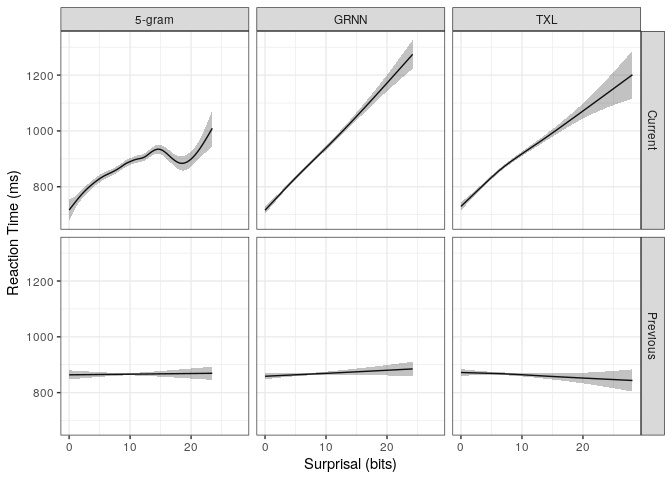

Natural Stories GAM analysis
================

    ## `summarise()` ungrouping output (override with `.groups` argument)

# Overview

100 participants read naturalistic stories from the natural stories
corpus. Each participant read 1 story.

We exclude

  - participants who do not report English as a native language (95
    remaining)
  - participants who do not get 80% of the words correct (63 remaining)
  - practice items (64714 words remaining)
  - words that were wrong or were within two after a mistake (58388
    words remaining)
  - the first word of every sentence (didn’t have a real distractor, RT
    is measured slightly differently) (55458 words remaining)
  - words with RTs \<100 or \>5000 (\<100 we think is likely a recording
    error, or at least not reading the words at all, \>5000 is likely
    getting distracted) (55384 words remaining)

Within the filtered data, each story was read between 3 and 8 times, for
an average of 6.3.

We also do the analyses on only the words before mistakes (per sentence)
(40809 words)

From the modelling side: (After attempts without doing this filtering)
we only include words which are single token and known words in each of
the models vocabularies. We also only include words with frequencies.
This is roughly equivalent to excluding words with punctuation.

We use as predictors:

  - length in characters of stripped word
  - unigram frequency of word. Frequencies for words are calculated
    using word\_tokenize on the gulordava train data and counting up
    instances. (This tends to tokenize off punctuation, but is
    capitalization sensitive). Frequencies are represented as log2 of
    the expected occurances in 1 billion words.

Surprisals are measured in bits.

  - ngram (5-gram KN smoothed)
  - GRNN
  - Transformer-XL

For GAM models, we center length and frequency but not surprisal. We
want surprisal interpretable, but we also will be plotting it (at least
for the bootstrapping) at length and frequencies set to 0, so they need
to be centered. (Not sure this last piece is actually true/matters).

    ## Parsed with column specification:
    ## cols(
    ##   Story_Num = col_double(),
    ##   Sentence_Num = col_double(),
    ##   Sentence = col_character()
    ## )

    ## Joining, by = c("Story_Num", "Sentence_Num")

## GAMs

Using only pre-error data.

Does not have hierarchical effects.

<!-- -->
